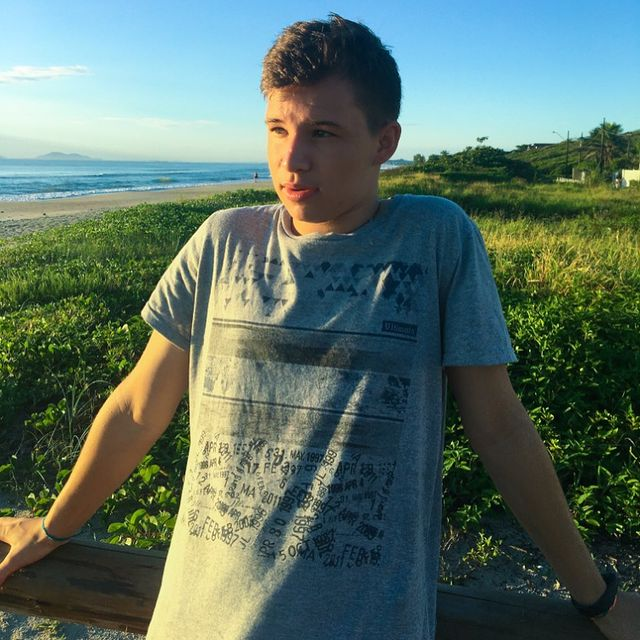
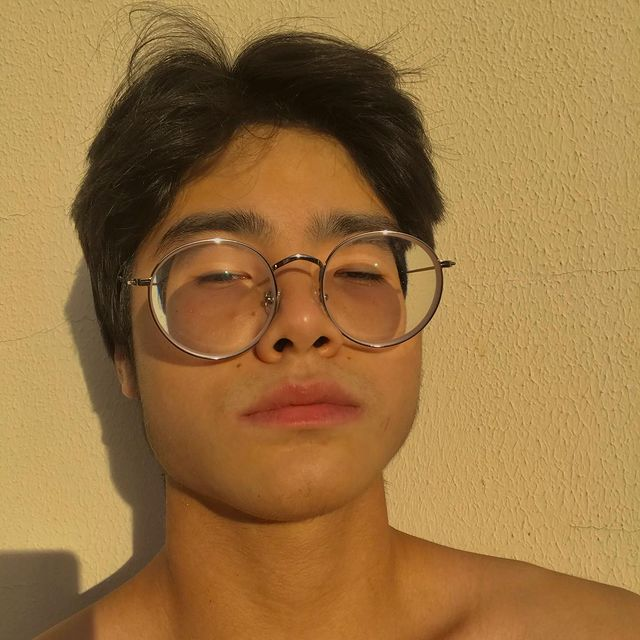
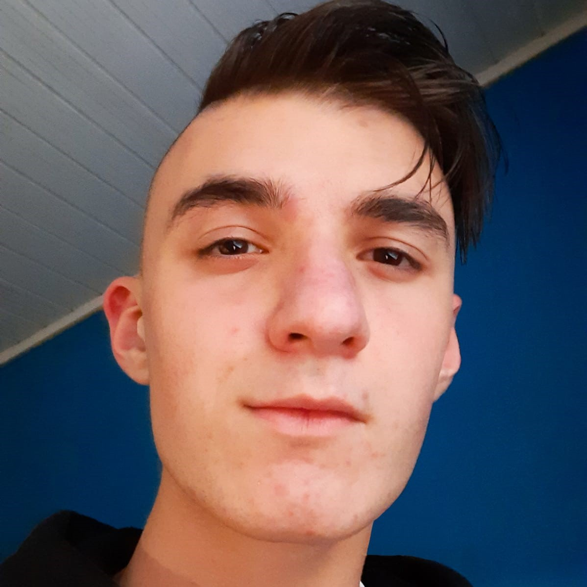
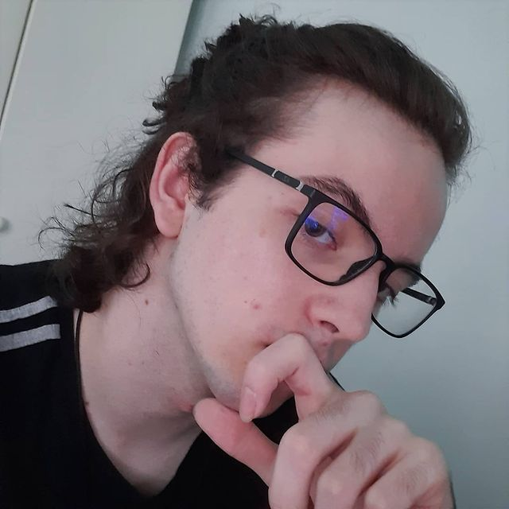
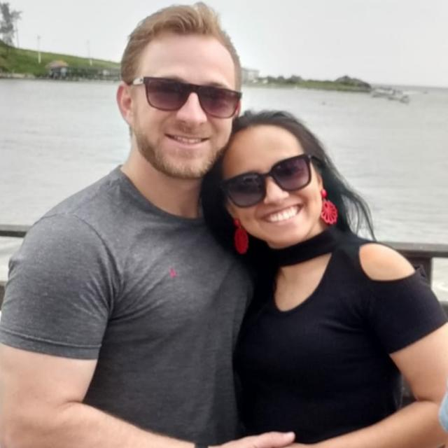
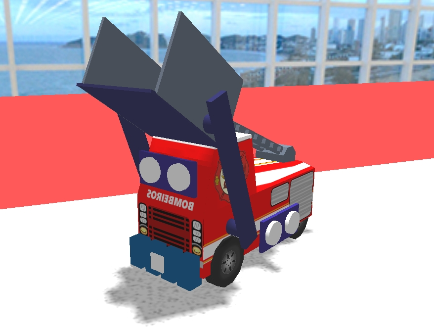

<h1 align="center">
	
	 
	⚙ OBR - Gears-Tet ⚙
</h1>
<h4 align="center">🚧 🧾 Projeto  e Programação 👨‍💻 Em construção... 🚧</h4>

  
	<a href="#sobre-a-equipe">Sobre a Equipe</a> •
	<a href="#membros">Membros</a> •
	<a href="#apresentação">Apresentação</a> •
	<a href="#simulação">Simulação</a>

## Sobre a Equipe
Somos a <a href="https://www.instagram.com/gearstet_17736/" title="Instagram da Equipe">Equipe Gears-Tet</a> do Colégio SESI de Rio Negro - PR. Estamos participando da OBR Prática Nível 2 em 2021 e esta é a programação da Prática Simulação!

> Unidos por um mesmo propósito! - Gears-Tet ⚙

A Equipe surgiu em 2019 para a FTC (FIRST Tech Challenge) e se manteve inativa no ano de 2020, porém em 2021 voltamos com força para superar desafios e dar o nosso melhor, sempre juntos!

## Membros

Atualmente nossa equipe conta com quatro integrantes e um mentor:
<table align="center">
<tr>
	<td align="center">
		
		 
		<b>Douglas Correa</b>
		 
		Roteirista 🧾
	</td>
	<td align="center">
		
		 
		<b>Enzo Coelho</b>
		 
		Montador 🔨
	</td>
	<td align="center">
		
		 
		<b>Gabriel Becker</b>
		 
		Montador 🔨
	</td>
	<td align="center">
		
		 
		<b>Nathan Train</b>
		 
		Programador 💻
	</td>	<td align="center">
		
		 
		<b>Julio Nestor</b>
		 
		Mentor 🧠
	</td>
</tr>
</table>

## Apresentação
Para a Prática - Apresentação, fizemos um vídeo no tema **Inovação**, baseando-se em uma ideia passada por gerações e que esse ano finalmente saiu do papel: 
<h4>Fazer uma <u>base giratória</u> com sua parte superior <u>fixa em relação ao chão</u></h4>

Para conferir o vídeo, clique [aqui](https://youtu.be/nOW6W068mj8)

No vídeo, o robô é criado a partir do sonho que um dos integrantes teve, mas na realidade, utilizamos de semanas para conseguir fazer a ideia ficar 100% eficaz, devido sua grande complexidade.

O nome do robô, Magni, vem do filho de Thor da mitologia nórdica, como explicado no vídeo.

## Simulação
Para a Prática - Simulação utilizamos da linguagem rEduc do simulador Sbotics (próprio da competição) junto do Robô 3 (Firetrekker) com o atuador Empilhadeira.

  
   
  <b>👨‍🚒 Firetrekker com Empilhadeira 👩‍🚒</b>
   

Utilizamos de ferramentas para nos auxiliar nossa lógica de programação, principalmente o [Whimsical](https://whimsical.com/), uma plataforma online para realizar a criação de Mapas Mentais e Fluxogramas. Também utilizamos o [Discord](https://discord.com/) para conversarmos e socializarmos entre nós e para discutir sobre a programação e estratégia sem termos que sair de casa.